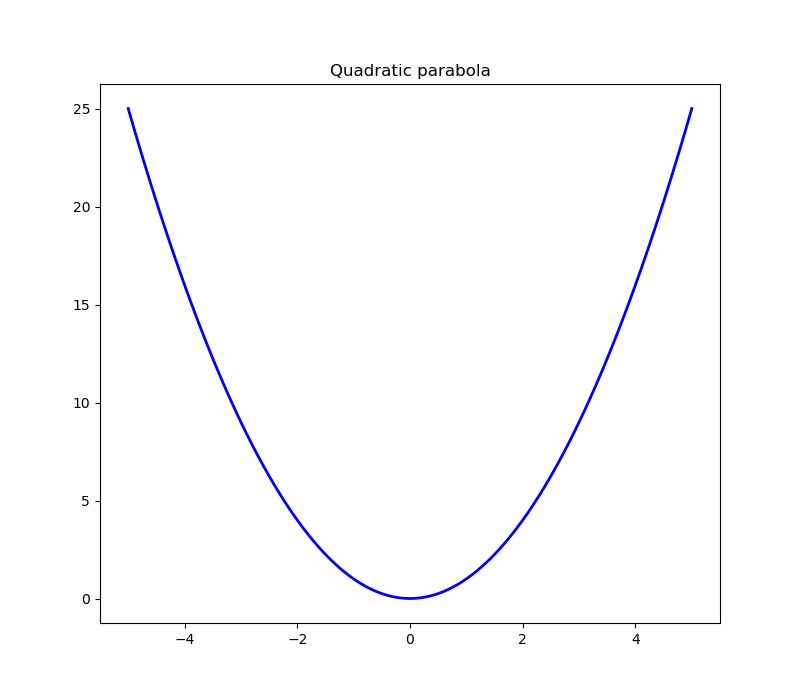

# Curvature measurement
In mathematics, the Menger curvature of three points in n-dimensional Euclidean space is the reciprocal of the 
radius of the circle that passes through the three points.  Intuitively, curvature is the amount by which a geometric 
object deviates from being:
* a **flat plane** in case of the *surface*, 
* a **straight line** in case of the *curve*.


In this project, the curvature measurement is applied to human left ventricle traces, in order to determine the 
occurrence of the left ventricular basal septal hypertrophy from 2 dimensional echocardiography (2D echo). The described
methods can be applied to any traces of the left ventricle. 

# Motivation
 Localized basal septal hypertrophy (BSH) is a known marker of a more advanced impact of afterload on cardiac function 
 in hypertension. There is variability in criteria used for defining BSH, mainly based on ratios of multiple septal wall
 thickness measurements with high inter-observer variability. The aim is to investigate septal curvature as a novel, 
 semiautomated method for better recognition of patients with BSH. 

# Screenshots
Examples of differences in septal curvature among 3 patients: healthy, hypertensive and hypertensive with septal bulge:


# How2use
### curvature.Curvature

**Call**
```python
Curvature(line=[(x1, y1), (x2, y2), (x3, y3) ... (xn, yn)] 
```

**Input**

Input argument *line* is a list of tuples. Each tuple contains 2 values, i.e. X and Y position on the 2D plane. 

**Output** 

Numpy array. Menger's curvature value for each tuple in the input list, except first and the last one. 

---
**Methods** 
### calculate_curvature(gap=0)

Calculates the curvature of the line. It is defined as the reciprocal of the radius of a circle intersecting three 
points in 2D space.
Optional parameter *gap* sets the number of points away from the processed point, based on which the curvature is calculated:
* if gap = 0, three consecutive points are used,
* if gap = 1, for point number 2, points 0 and 4 are used, for point number 3, points 1 and 5 are used and so on, 
* if gap = 2, for point number 3, points 0 and 6 are used, for point number 4, points 1 and 7 are used and so on. 

It has been included as a smoothing option, with the trade-off on information loss.

---
### plot_curvature()

Plots the curvature values as a line plot. 

---
**Example (quadratic parabola)**
```python
import numpy as np
from curvature import Curvature

x = np.linspace(-5, 5, 1001)
y = (x ** 2)
xy = list(zip(x, y))  # list of points in 2D space

curv = Curvature(line=xy)
curv.calculate_curvature(gap=0)

print('Curvature values (first 10 points): {}'.format(curv.curvature[:10]))
print('Curvature values (10 middle points): {}'.format(curv.curvature[int(len(x)/2-5):int(len(x)/2+5)]))
print('Maximum curvature: {}'.format(max(curv.curvature)))
print('Minimum curvature: {}'.format(min(curv.curvature)))

curv.plot_curvature()
```
Results:
```text
Curvature values (first 10 points): [0.00198212 0.00199397 0.00200591 0.00201794 0.00203007 0.0020423
 0.00205463 0.00206705 0.00207958 0.00209221]
 
Curvature values (10 middle points): [1.98075815 1.98905163 1.99501104 1.99860098 1.99980002 1.99860098
 1.99501104 1.98905163 1.98075815 1.97017947]
 
Maximum curvature: 1.9998000199980006
Minimum curvature: 0.0019821241706415283
```



### class Cohort (bsh.py)
The aim of this class is to calculate the curvature of the trace of left ventricle and find indices that are useful for
classification of the basal septal hypertrophy in hypertensive patients. The indices include *maximum* and *minimum* 
curvature, the *changes in curvature over the cycle* and *interactions* between them. The derived indices are useful for the 
statistical analysis, and show potential to unveil the basal septal hypertrophy setting in a robust, unbiased way.

**Call**
```python
class Cohort(source_path='path_to_data', view='4C', output_path='path_to_store_results', 
output='name_of_output_file.csv')
```

**Input**

*source_path*: path to the .csv files containing the myocardial trace obtained with speckle tracing in EchoPAC. 
 

*view*: the view in which the image was taken; 4-chamber ('4C'), 3-chamber ('3C'), or 2-chamber ('2C') 

 
*output_path*: path to a folder where the results of computation and plots will be stored 

 
**Output** 

1 Tables:

* File names in the input directory with corresponding IDs of cases,

* Curvature values of the trace changing in the cardiac cycle,

* All derived indices calculated in available views,

* Simple statistical values of the derived indices,

* Lists of most prevalent cases, in terms of the derived indices. 

2 Plots:

* Inidividual plots of the trace and the curvature throughout the cardiac cycle,  

* Distributions of the derived indices in the population. 

---
**Methods**
### print_names_and_ids(to_file=False, views=('4C', '3C', '2C')) 

Creates (or prints) the table with names of the files and corresponding IDs. Useful when the clinician provides tables with different IDs, unrelated to one another. 

*to_file* controls whether the table is saved to file, or is printed in the console. 

*views* list is used to choose the relevant views to print out. The function prints the names and IDs for all views by default. 

_Example:_ 
```python
Cohort.print_names_and_ids(views=['4C'])
```
|  |  |  |  |  |  |
|:---:|:---:|:---:|:---:|:---:|:---:|
| AAAC0130_4C | BBB0460_4C | CCC0043_4C |  DD_4C | EE_4C | ...
| AAAC0130 | BBB0460 | CCC0043 | X 7323260121 | aiouey11022017 | ...

--- 
### save_curvatures()

Saves the curvature of individual trace over 1 cycle. Rows denote the frames and columns are the separate points of the trace. 

_Example:_ 
```python
Cohort.save_curvatures() 
```

In *~/output_curvature/curvatures/ABCDE0123.csv*:

Frames/trace points | 0 | 1 | 2 | 3 | 4 | ...
 :---:|:---:|:---:| :---: | :---: | :---: | :---:
  0 | -0.0004368951 | -0.0008411005 | 9.81975201759697E-05 | -0.0023831521 | -0.0045366323 | ...
  1 | 0.0004937481 | -0.0003834384 | -0.0003401089 | -0.0018914279 | -0.0039957284 | ... 
  2 | 0.0005044135 | -0.001319833 | 0.0011134577 | -0.0028624835 | -0.0044718255 | ...
  3 | 0.0005097837 | 0.0006038951 | -0.0013404811 | -0.0013120823 | -0.0049921892 | ...
  4 | 9.36306817606534E-05 | -0.0008662325 | 0.0001828868 | -0.0033066163 | -0.0034790443 | ... 
 ... | ... | ... | ... | ... | ... | ...

--- 
### save_indices() 

Saves the derived indices of the current view to a .csv file. The meaning of the indices is listed in the table below.

 Index name | Description
 --- | ---
 min | Minimum curvature value in the cycle
 max | Maximum curvautre value in the cycle
 min_delta | The change of the curvature value at the trace point with minimum curvature within the cycle. 
 max_delta | The change of the curvature value at the trace point with maximum curvature within the cycle.
 amplitude_at_t | Maximum difference between the lowest and highest curvature in the trace in a single time frame.
 min_index | Interaction between *min* and *min_delta* (multiplication)
 min_index2 | Interaction between *min* and *min_delta* (ratio)
 log_min_index | Natural logarithm of the *min_index*. Used to get the gaussian distribution of that index.
 min_v_amp_index |  Interaction between *min* and *amplitude_at_t* (multiplication)
 log_min_v_amp_index | Natural logarithm of *min_v_amp_index*. Used to get the gaussian distribution of that index.
 delta_ratio | Interaction between *min_delta* and *max_delta* (ratio)

_Example:_ 

In *~/output_curvature/_all_cases.csv*:

Cases/indices | min | max | min_delta | max_delta | amplitude_at_t | min_index2 | min_index | log_min_index | min_v_amp_index | log_min_v_amp_index | delta_ratio
:---:|:---:|:---:|:---:|:---:|:---:|:---:|:---:|:---:|:---:|:---:|:---:
ABC0123 | -0.0405158262 | 0.1241208005 | 0.0385328157 | 0.0647216494 | 0.1171728977 | 0.9510559044 | 1.5611888659 | 0.4454476246 | 4.5150016783 | 1.5074055586 | 0.595362079
BCD0234 | -0.0342108651 | 0.0972381045 | 0.019898385 | 0.0388777246 | 0.1146886061 | 0.5816393389 | 0.6807409648 | -0.38457342 | 2.282118037 | 0.8251039753 | 0.5118196907
CDEG0345 | -0.049368904 | 0.103583772 | 0.0181921495 | 0.0386067579 | 0.119485792 | 0.3684940926 | 0.8981264815 | -0.1074443726 | 2.1737033887 | 0.7764323436 | 0.4712167114
...|...|...|...|...|...|...|...|...|...|...|...

--- 
### get_statistics() 


Builds a table with means and standard deviations of the derived indices for different labelled cohorts. It is useful for quick hypothesis testing. 

_Example:_ 

Index/statistics | mean_0 | mean_1 | mean_2 | std_0 | std_1 | std_2
:---: | :---: | :---: | :---: | :---: | :---: | :---:  
4C_min | -0.0201778317 | -0.0306086873 | -0.0594613681 | 0.0094344275 | 0.0170520522 | 0.0360928091
4C_max | 0.1087235323 | 0.109365046 | 0.0957044432 | 0.0236570663 | 0.0265233657 | 0.0239325507
4C_min_delta | 0.0227348783 | 0.0248032401 | 0.0379769438 | 0.010082188 | 0.0134498406 | 0.0337178725
4C_max_delta | 0.0446129786 | 0.0455289686 | 0.0399468814 | 0.0181516539 | 0.0189862068 | 0.0169131205
... | ... | ... | ... | ... | ... | ...
3C_amplitude_at_t | 0.1167719637 | 0.1246514751 | 0.1331294584 | 0.0236643173 | 0.0369586565 | 0.0386191622
3C_min_index2 | 1.0520912139 | 1.2492809199 | 1.0500957051 | 0.4744280389 | 1.1546531841 | 1.1060600567
3C_min_index | 2.2969437175 | 2.1863779053 | 2.7044641932 | 2.8040017642 | 3.5199219066 | 2.8053581802
... | ... | ... | ... | ... | ... | ...
2C_log_min_v_amp_index | 0.9189543648 | 0.9803873018 | 0.9060236148 | 0.6162538405 | 0.6604411427 | 0.8709891975
2C_delta_ratio | 0.8166180442 | 0.5427945579 | 0.5226342278 | 0.4526526978 | 0.3259621391 | 0.4914749823
label | 0 | 1 | 2 | 0 | 1 | 2

--- 
### get_extemes(n=30) 


Creates a table with IDs of cases with most prevalent indices and interactions. It is useful for the analyst to decide on which indices are relevant for the classification. 

*n* is the number of cases to print for each index.

_Example:_

Index/Order | 0 | 1 | 2 | 3 | 4 | ...
:---: | :---: | :---: | :---: | :---: | :---: | :---:
min | AAA202 | BBB392 | CCC287 | DDD237 | EEE017 | ...
min | -0.001953125 | -0.0045234734 | -0.0047688238 | -0.0057060377 | -0.0061885245 | ..
max | GGG143 | ZZZ0118 | HHH002 | CCC449 | RRR426 | ...
max | 0.2076821012 | 0.1961639528 | 0.1940575819 | 0.1619409786 | 0.1581591041 | ...
min_delta | VVV456 | MMM270 | AAA269 | FFF397 | KKK454 | ...
min_delta | 0.1501618275 | 0.1325194951 | 0.071514939 | 0.071109584 | 0.0663142855 | ...
max_delta | JJJ143 | KKK118 | AAA002 | DDD272 | LLL304 | ...
max_delta | 0.1270445332 | 0.1089291092 | 0.0903139148 | 0.0835954327 | 0.0815581419 | ...
amplitude_at_t | XXXe456 | EEE270 |PPP269 | DDD115 | NNN308 | ...
amplitude_at_t | 0.2161523475 | 0.2101911611 | 0.1866468858 | 0.1859104827 | 0.1799677971 | ...
... | ... | ... | ... | ... | ... | ...
--- 
### plot_curvatures(coloring_scheme='curvature') 

Plots the with traces in a given view and the curvature of each points in the trace in each frame. The traces can be 
coloured according to the value of the curvature, or the frame number. This function also creates heatmaps showing the
curvature of the trace in the given view changing in time. End-diastolic and end-systolic frames are found by
calculating the maximum and minimum area covered by the trace.  

*coloring_scheme* - if set to 'curvautre', the plot shows the positive curvature as red and negative curvature as blue.
Otherwise, by default, the colors correspond to the frame number. This feature is not perfect, as it is not possible to 
relate the frame number to cycle makers, such as aortic valve closure, mitral valve opening, etc.

_Example:_
```python
Cohort.plot_curvatures(coloring_scheme='curvature')
```


--- 
### plot_mean_curvature()

Plots curvature, where for each point in the the trace a mean of the curvature over the full cycle is calculated.

_Example:_
```python
Cohort.plot_mean_curvature()
```


---
### plot_distributions(plot_data=False, plot_master=False, table_name=None) 

Plots the distributions of the derived indices, for univariate and bivariate exploratory data analysis. 

*plot_data* - if set to true, plots the univariate plots of available indices from a single view. With *table_name set
to 'master_table.csv', it will plot the bivariate interactions between the indices (provided that the 'master_table
exists)

*plot_master* - if set to true, also plots the univariate plots, but from all the available views. With *table_name set
to 'master_table.csv',the function will plot bivariate interactions between the indices (provided that the 'master_table
exists and different views indices are avaiable).
  
_Examples:_ 
```python
Cohort.plot_distributions(plot_data=True, table_name=all_cases_with_labels.csv)
```


```python
Cohort.plot_distributions(plot_data=True, table_name=all_cases_with_labels.csv)
```


---

**Full example**

```python
import os
from bsh import Cohort

source = os.path.join('~/Python/data/curvature')
target_path = os.path.join('~/Python/data/curvature/')

cohort = Cohort(source_path=source, view=_view, output_path=target_path)

cohort.get_extemes(32)
cohort.plot_curvatures('asf')
cohort.plot_curvatures(coloring_scheme='curvature')
cohort.save_curvatures()
cohort.plot_distributions(plot_data=True, table_name='_all_cases_with_labels.csv')
cohort.print_names_and_ids(to_file=True)
```

# Credits
Abstract

# License