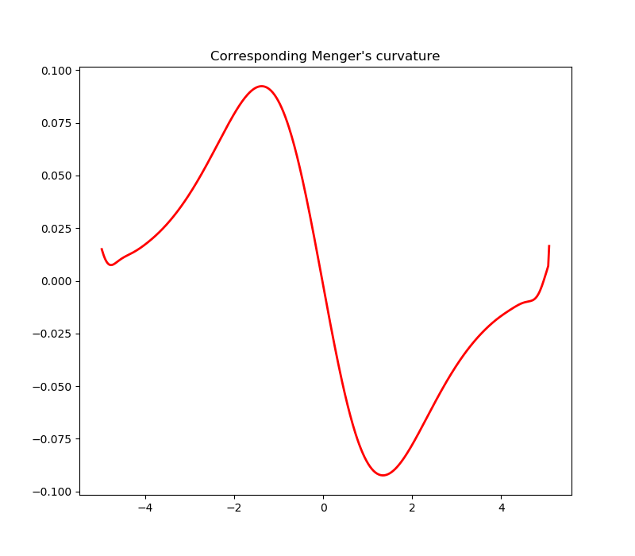

# Curvature measurement
In mathematics, the Menger curvature of three points in n-dimensional Euclidean space is the reciprocal of the
radius of the circle that passes through the three points.  Intuitively, a curvature is the amount by which a geometric
object deviates from being a **straight line** in case of the *curve*.

In this project, the curvature measurement is applied to human left ventricle traces, in order to determine the
occurrence of the left ventricular basal septal hypertrophy from 2 dimensional echocardiography (2D echo). The described
methods can be applied to any traces of the left ventricle.

# Motivation
 Localized basal septal hypertrophy (BSH) is a known marker of a more advanced impact of afterload on cardiac function
 in hypertension. There is variability in criteria used for defining BSH, mainly based on ratios of multiple septal wall
 thickness measurements with high inter-observer variability. The aim is to investigate septal curvature as a novel,
 semiautomated method for better recognition of patients with BSH.

# Screenshots
Examples of differences in septal curvature among 3 patients: healthy, hypertensive and hypertensive with septal bulge:

---

---

# Credits
Please cite the following publication:

Marciniak M, Gilbert A, Loncaric F, Fernandes JF, Bijnens B, Sitges M, King A, Crispi F, Lamata P. Septal curvature as a robust and reproducible marker for basal septal hypertrophy. J Hypertens. 2021 Jul 1;39(7):1421-1428. doi: 10.1097/HJH.0000000000002813. PMID: 33534345; PMCID: PMC8183485.
